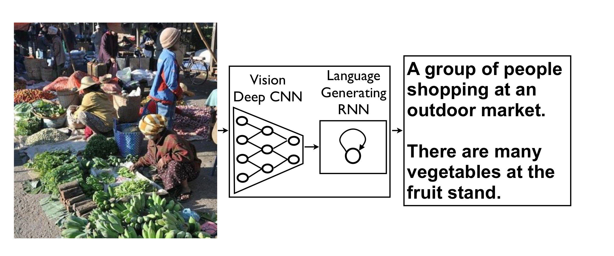
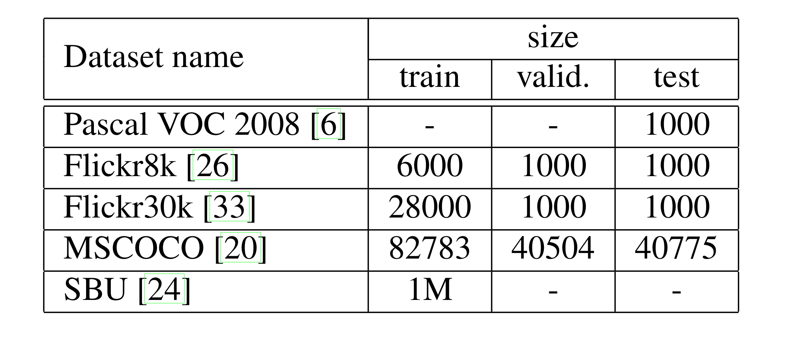

## Show and Tell: A Neural Image Caption Generator

### 1.What is this paper about?

NIC
↓detail
An end-to-end neural network system that can automatically view an image and generate a reasonable description in plain English. 

### 2.What’s better than previous paper?

previous one is mainly that an “encoder” RNN reads the source sentence and transforms it into a rich fixed-length vector representation, which in turn in used as the initial hidden state of a “decoder” RNN that generates the target sentence.

This paper propses replacing the encoder RNN by a deep convolution neural network (CNN).

### 3.What are important parts of technique and methods?

 

Replacing the encoder RNN by a deep convolution neural network (CNN).

### 4.How did they verify it?

we verify to generate description given image and explore the robustness of our propose in terms of qualitative results (the generated sentences are very reasonable) and quantitative evaluations, using either ranking metrics or BLEU, a metric used in machine translation to evaluate the quality of generated sentences.

### 5.Is there a debate?

### dateset
 

