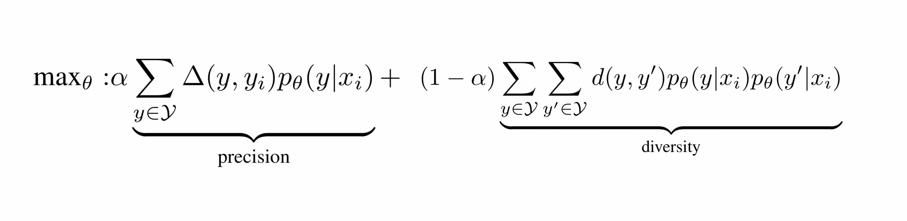

## Better Captioning with Sequence-Level Exploration

### 1.What is this paper about?

It proposes to add a sequence-level exploration term to the current objective to boost recall because current one only optimizing the precision side.

### 2.What’s better than previous paper?

previous model is equivalent to only optimizing the precision side of the caption set generated by the model and therefore overlooks the recall side.

It guides the model to explore more plausible captions in the training. In this way, the proposed objective takes both the precision and recall sides of generated captions into account. 

### 3.What are important parts of technique and methods?

It shows that the diversity is a proxy mesurement of recall and  formularizes following to cover
the recall side of the problem.

 

### 4.How did they verify it?

### 5.Is there a debate?
