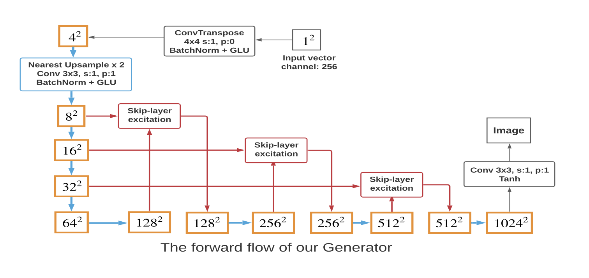
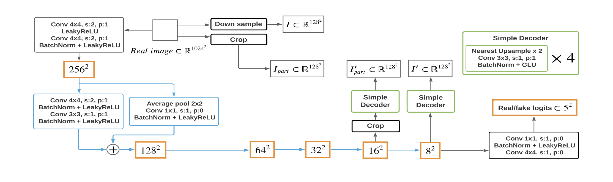
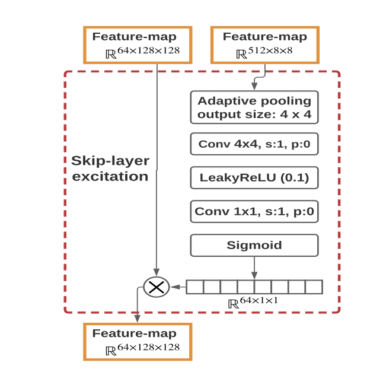
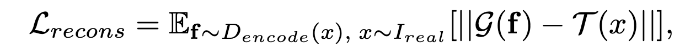

## TOWARDS FASTER AND STABILIZED GAN TRAINING FOR HIGH-FIDELITY FEW-SHOT IMAGE SYNTHESIS

### 1.What is this paper about?

このモデルは、a skip-layer channel-wise excitation moduleと、特徴エンコーダとして訓練されたself-supervised discriminatorを用いて、少ないデータセットに対しても高画質かつ高品質な画像生成を可能にした。

### 2.What’s better than previous paper?

既存研究では、少ないデータセットで高画質の画像を生成するための学習を試みると、computing costが多くかかってしまった。原因としては、高画質画像の生成ではup-sampling layerが必然的に多くなり、Gが深いモデルになってしまい、パラメータやweaker gradient flowになってしまうからである。

しかし、本モデルでは、SKIP-LAYER CHANNEL-WISE EXCITATIONとSELF-SUPERVISED DISCRIMINATORをVanilaGANに導入することで、低い計算コストで、高画質の画像を生成できるようになった。

### 3.What are important parts of technique and methods?

本モデルの、GとDの概要を以下の図に示す。

SKIP-LAYER CHANNEL-WISE EXCITATION

ResBlockと同様に,Skip-connectionを利用した構造である。本来のResBlockでは、加算している部分を積を用いることによって、ある程度離れた次元間のスキップ接続を可能にしている。以下に、本layerの詳細を示すFigを示す。

SELF-SUPERVISED DISCRIMINATOR

GANのDescriminater Dをエンコーダとして扱い、それを小さなデコーダで訓練する。
デコーダは，切り取られたf1からI’partを，f2からI′を生成する． 最後に，Dとデコーダは，I'partとIpart，I′とIをマッチングさせて，以下の損失関数を最小化するように一緒に学習される

### 4.How did they verify it?

13個のデータセットを使用した。
On 256 × 256 resolution, we test on Animal-Face Dog and Cat (Si & Zhu, 2011), 100-Shot-Obama, Panda, and Grumpy-cat (Zhao et al., 2020). 
On 1024 × 1024 resolution, we test on Flickr-FaceHQ (FFHQ) (Karras et al., 2019), Oxford-flowers (Nilsback & Zisserman, 2006), art paintings from WikiArt (wikiart.org), photographs on natural landscape from Unsplash (unsplash.com), Pokemon (pokemon.com), anime face, skull, and shell. 

metricsは以下の二つである。
Frechet Inception ´ Distance (FID) (Heusel et al., 2017)、LPIPS（Zhang et al., 2018）

比較対象としては、SOTAの無条件画像生成モデルであるStyleGAN2とベースライン(without proposed method)で比較を行った。

### 5.Is there a debate?

### 6.What paper should I read next?

