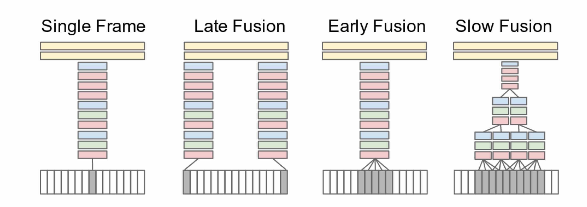

## Large-scale Video Classification with Convolutional Neural Networks

### 1.What is this paper about?

About video classification with CNN.
1. The mulitple approaches for extending the connectivity of the a CNN in time domain to take advantage of local spatio-temporal information.

2. A multiresolution, foveated architecture to speed up the training and make it easy to classify large data like a video.

3. How does transfer learning affect the score?

### 2.What’s better than previous paper?

Previous method involves three major stages: 
1. Local visual features that describe a region of the video are extracted. 
2. The features get combined into a fixed-sized video- level description. 
3. A classifier (such as an SVM) is trained on the resulting ”bag of words” representation to distinguish among the visual classes of interest.

Our work is to evaluate Convolutional Neural Networks.
It models that replace all threestages with a single neural network that is trained end to end from raw pixel values to classifier outputs.

### 3.What are important parts of technique and methods?

 

 

this model takes advantage of the camera bias that the object of interest often occupies the center region. So input frames are fed into two separate streams of processing over two spatial resolutions.

-A context stream

It receives the downsampled frames at half the original spatial resolution (89 × 89 pixels) and learns features on low-resolution flame.

-A fovea stream

It receives the center 89 × 89 region at the original resolution and processes high-resolution center crop.

### 4.How did they verify it?

Sports-1M dataset, which consists of 1 million YouTube videos belonging to a taxonomy of 487 classes of sports

By sepatrating two stream of prosessing, We observe a 2-4x increase in runtime performance of the network due to the reduced dimensionality of the input without sacrificing accuracy.

This transfer learning experiments on UCF-101 suggest that the learned features are generic and generalize other video classification tasks. In particular, this paper achieved the highest transfer learning performance by retraining the top 3 layers of the network.

### 5.Is there a debate?