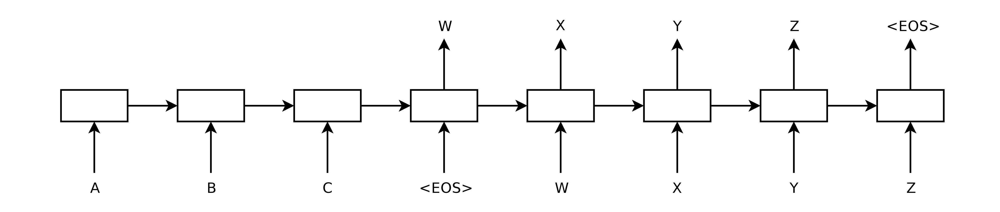

## Sequence to Sequence Learning with Neural Networks

### 1.What is this paper about?

Translation English to French with LSTM

### 2.What’s better than previous paper?

the LSTM did not suffer on very long sentences, despite the recent experience of other researchers with related architectures because of reversing order sentence.

### 3.What are important parts of technique and methods?

 

method uses a multilayered Long Short-Term Memory (LSTM) to map the input sequence to a vector of a fixed dimensionality, and then another deep LSTM to decode the target sequence from the vector.

we reversed the order of words in the source sentence but not the target sentences in the training and test set.

### 4.How did they verify it?

We evaluate to translate English to French with BLEU score.

### 5.Is there a debate?