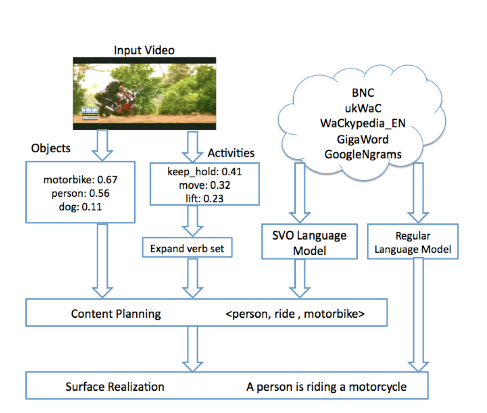

## Generating Natural-Language Video Descriptions Using Text-Mined Knowledge

### 1.What is this paper about?

It proposes the model that generates natural-language descriptions for videos, which combines the output of state-of-the-art object and activity detectors with “real-world” knowledge to select the most probable subject-verb-object triplet.

### 2.What’s better than previous paper?

It make extensive use of text-mined knowledge to select the best SVO triple and generate coherent sentences, without requiring the expensive collection and annotation of a similar training video corpus.

### 3.What are important parts of technique and methods?

 

Key point is to have two stage and the function which called "verb expansion".

1. content planning stage

Identifies the most likely subject, verb and object (SVO) using a combination of visual object and activity detectors and text-mined knowledge to judge the likelihood of SVO triplets from a natural-language generation (NLG) perspective.

2. surface realization stage

Given the selected SVO triplet, it uses a simple template based approach to generate candidate sentences which are then ranked using a statistical language model trained on web-scale data to obtain the best overall description. 

* verb expansion
It is incorporating the pragmatics of various entities likelihood of being the subject/object of a given activity, learned from web-scale text corpora and help to suggest plausible verb from subject and object.

### 4.How did they verify it?
* Content Planning

From the ∼ 50 human descriptions available for each video, we identified the SVO for each description and then determined the ground-truth SVO for each of the 185 test videos using majority vote.

To evaluate the accuracy of SVO identification, we used two metrics. 
first 
a binary metric that requires exactly matching the gold-standard subject, verb and object
→unduly harsh

Second
In order to account for similarities, we also measure the WUP similarity between the predicted and correct items.

* Surface Realization

> Automatic Metrics...BLEU and METEOR metrics
> Human Metrics...Amazon Mechanical Turk
> Compare to Vision Baseline

### 5.Is there a debate?

the person detector has higher recall and confidence than the other object detectors because of a few testing date. 
