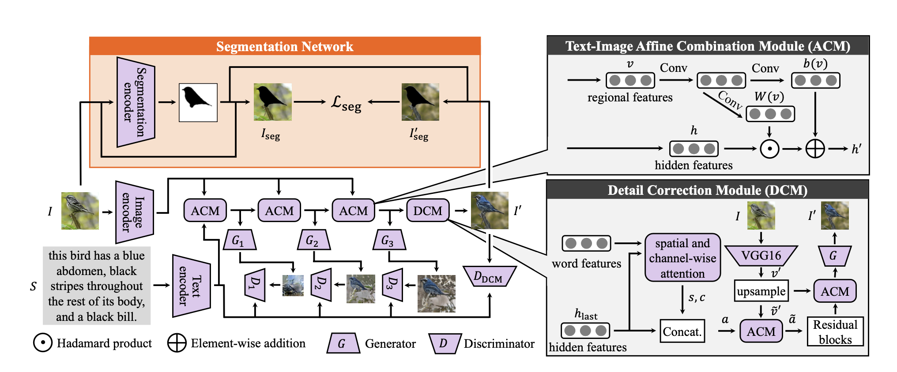
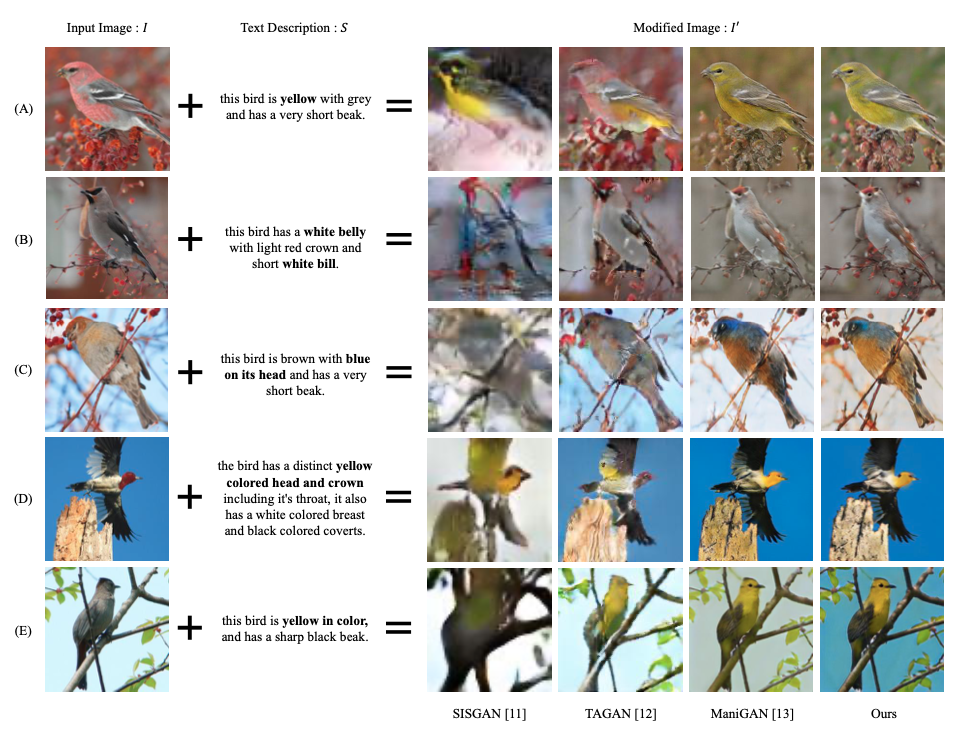

## Segmentation-Aware Text-Guided Image Manipulation

### 1.What is this paper about?

It proposes a novel approach that improves text-guided image manipulation performance.

### 2.What’s better than previous paper?

Privious model focused on maniplate the image.
By taking into account the segmentation loss of the background image, it is possible to manipulate the image while maintaining the background.

### 3.What are important parts of technique and methods?

 

- Segmentation Network
The loss is calculated from the segmentation of the background image before and after image generation, and the loss is reduced so that the background image can be maintained.

### 4.How did they verify it?

- Quantitative Comparison

It is evaluated on the CUB bird dataset, comparing with three state-of-the-art approaches SISGAN, TAGAN and ManiGAN on image manipulation using natural language descriptions using inception score (IS) the Neural Image Assessment (NIMA) as evaluation metrics.

- Qualitative Comparison

 

It has produced results that are equal to or better than state-of-the-art methods.

### 5.Is there a debate?

