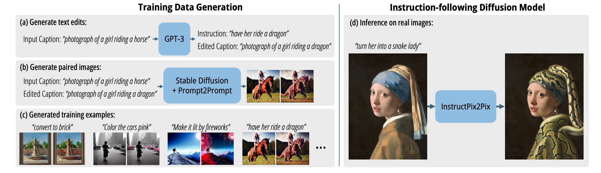
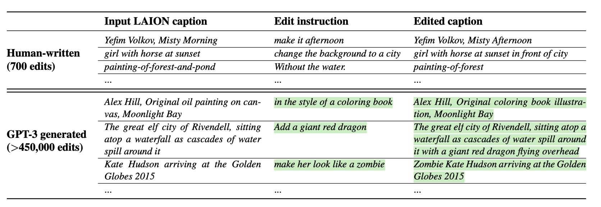
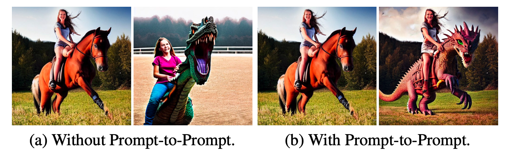
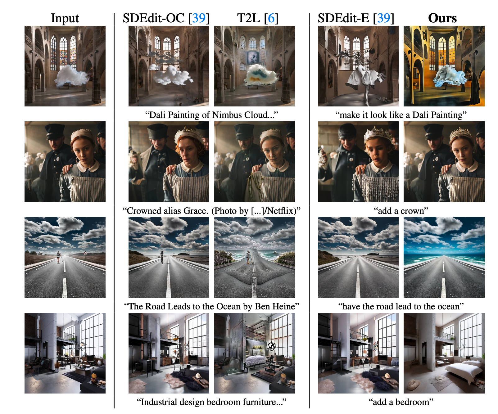
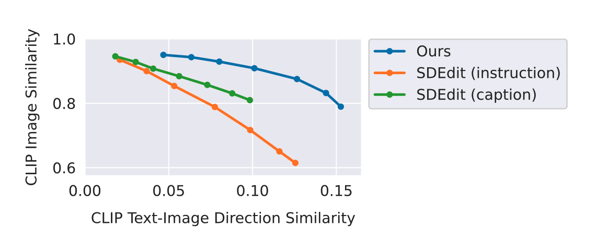

## InstructPix2Pix: Learning to Follow Image Editing Instructions

### 1.What is this paper about?

pre-trainedのGPT-3とStable Diffusionの事前知識を用いて、生成されたデータセットを用いて、
学習させ、zero-shotで、text instruct-based image manipulationモデルである。

### 2.What’s better than previous paper?

フォワードパスで直接画像編集を行うため、infereceの速度が速く、fine-tuneも必要がない。
さらに、正解データセットも必要ではなく、生成されるデータセットで学習を進める。
inference時の、文章はtext descriptionである必要はなく、textのinstructionだけでいい。

### 3.What are important parts of technique and methods?

 

GPT-3を使うことで、700個の手動で生成した、文章を入力しfine-tuneすることで以下のような出力を得ることができるらしい。

 

さらに、Prompt-to-Promptを用いて、入力画像を保存したまま、ワードの編集に対応した画像を生成できる。それを今回は、入力データとground-truthとして扱う。

 

最後に、Prompt-to-Promptの中の、類似度をcontrallできるpの値[0.1、0.9]で画像を、キャプション1組につき100組生成する、CLIP-based metricを使用して、Filterlingして、生成されるtrain dataの質を担保する。

### 4.How did they verify it?

SDEditとText2Liveと定量的・定性的に比較した。

定性的比較

両方の結果と比較していい結果でした。
 

定量的比較

metrics
cosine similarity of CLIP image embeddings (入力画像と出力画像がどれくらい一緒か)

the directional CLIP similarity (テキストキャプションの変化が画像の変化とどの程度一致するか）

この二つのmetricsはcompetingなmetricsだから見づらい。

 

### 5.Is there a debate?

生成されるデータセットに依存してしまう。

「画像の左に移動させる」、「位置を入れ替える」、「コップを二つテーブルに置き、一つ椅子に置く」などの、モノの数や、空間推論が苦手。

確かに、text(-instructed) image manipulationは、いつもground-truthを生成することで、trainを行っていた。
正解データを作ってしまうというのは、とても面白い。
なんか、StyleGANでも正解データ作っちゃうみたいなノリもある。(GAN-Supervised Dense Visual Alignment)

### 6.My interest paper in this paper
- Prompt-to-prompt image editing with cross attention control.

