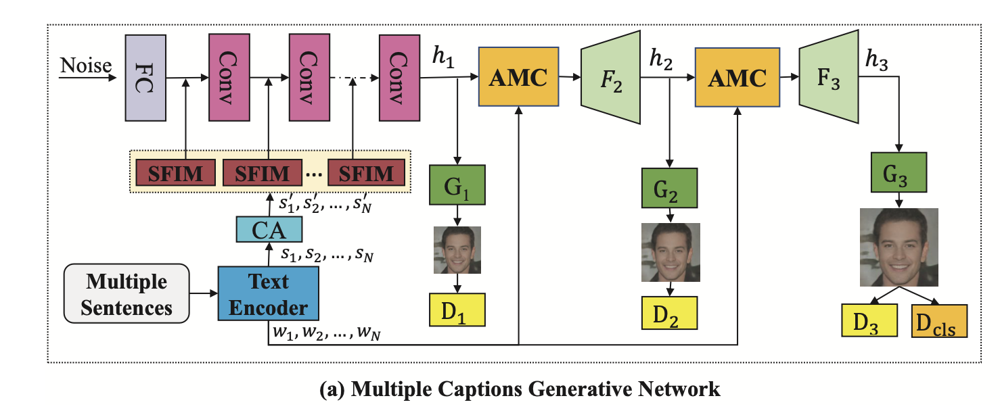
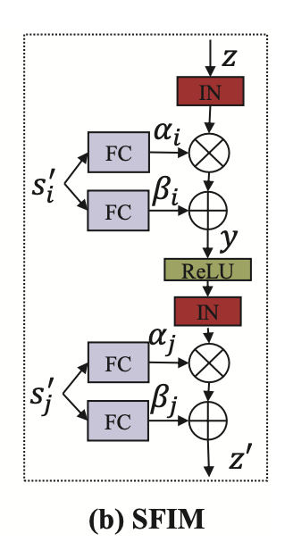
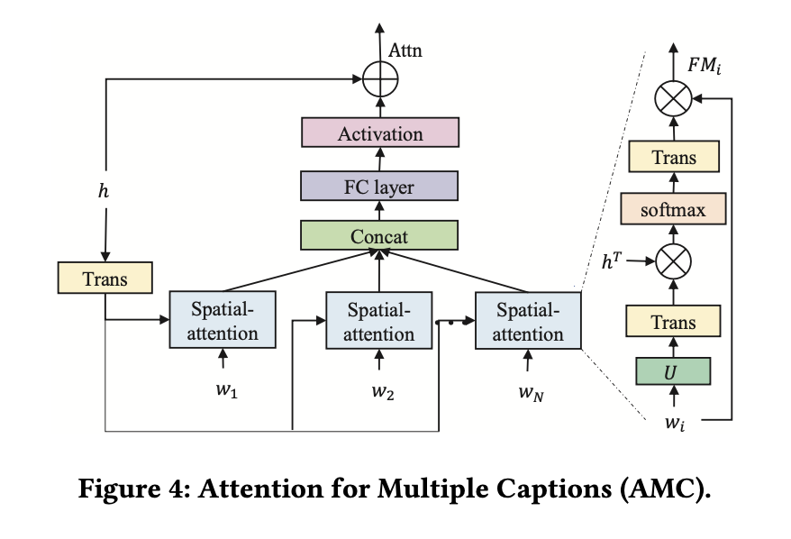

## Multi-caption Text-to-Face Synthesis: Dataset and Algorithm

### 1.What is this paper about?

It proposes the novel Text2Face model(SEA-T2F) with multi-captions and large-scale text-face dataset.
Speficicaly, it introduce the sentence feature injection module, attention module and attribute loss.

### 2.What’s better than previous paper?

Originally, one caption is not enough to match the users' preference for text2face task.
In this paper, it publish the high quality text-face dataset, so it can use multi-caption.
For this task, it propose novel model, then it can generate more high quality face images than exsiting mode with multi-captions.

### 3.What are important parts of technique and methods?

This is the overall of SEA-T2F.
 

This model adapt the multi-GAN and doesn't concat the noise and sentence vector but only noise as input.

- SFIM
It aims to multi-sentense to inject in the model.
In upsampling archtecture, it injects sentence info between each layer as following Fig.

- AMC
たくさんの単語を、視覚情報と結びつけることができるattention機構を提案した。
具体的には、Speatial-attentionを並列に結び付けることで、computation costを削減し、複数単語-visual infoのcross informationの獲得を可能にした。

### 4.How did they verify it?

複数文章で画像を生成するexsistingモデルは、提案手法がほとんどなく、あったとしても莫大なcomputing costを有し、実用性がとても低いため、このモデルは、1-captionの顔画像生成を用いて評価を行った。
具体的には、1-caption text-faceモデルの(AttnGAN, ControlGAN)と、1つの文章を10個copyして10-caption text-faceモデルを使用して定性的、定量的比較を行った。
いかにそれらの評価結果を示す。

metricsとしては、Inception Scoreと、top-5 image retrieval accuracy (Top-5 Acc)の二つを用いた。
前者は、画像のquality、後者は画像とtextのmatch度を示したものである。

さらに、複数文章が存在するCUB datasetを使用して、text-imageモデルを生成した。
先ほどの評価と同様に、1-captionで画像を生成しても、高い精度の画像を生成することができた。
それらの、結果をqualitative、quantitativeの表にまとめた。その結果を以下に示す。

1-caption to image synthesizeの分野においても、先行研究より優れた画像を生成することができた。

さらに、10-captionsを使用して顔画像、鳥画像を生成した結果をいかに示す。

### 5.Is there a debate?
