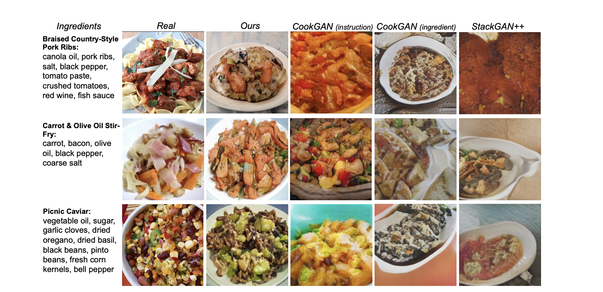

## Cycle-Consistent Inverse GAN for Text-to-Image Synthesis

### 1.What is this paper about?

この論文は、Inverse GANを、text2image, text-based image manipulationに適用したCycle-consistent Inverse GAN (CI-GAN)を提案した。

### 2.What’s better than previous paper?

既存のGANモデルでは主に、テキストと画像のペア学習を行っていて、テキストと画像の組み合わせが限られていた。そのため、生成される画像は対応する実画像とテキストのペアで正則化されるので、モデル表現の多様性が制限されます。
さらに、生成された画像中のテキストと無関係な他の属性を保持したまま1つの属性だけを変更することは困難あった。

しかし、このモデルでは、pre-traindしたStyleGANの潜在空間Wに、Inverse GANで生成した潜在空間w'を落とし込むため、disentangledな特徴になり、潜在コードの意味を明らかにすることで、テキスト記述に対応する高品質な画像を生成することができ、さらに1つの属性だけを変更するなどのimage based image manipulationのタスクも行えるようになった。

### 3.What are important parts of technique and methods?

Cycle-Consistent Constraintを使用することによって、Inverse GANで生成された潜在コードw′がpre-trained StyleGANの潜在空間wとマッチングし、潜在コードが操作・解釈できるような一貫した制約を適用することができる。

具体的には、画像と潜像符号の２つにGANのstrategyを使用した。
画像に対しては、
元の画像と、潜像符号から潜在空間を介して生成された画像を使用することで、損失と計算する。

潜像符号に関しても同様に、
元の潜像符号と、潜在空間から生成された潜像符号を使用することで、損失と計算する。

さらに、InfoNCE lossをテキストと潜在空間の類似度計算に使用した。
既存の研究では、pair-wise lossを主としていた。しかし、pair-wise lossは、iterationsにおいて各サンプルに1つのペアしか考慮しないため、ペア間の関係を定式化することができなかった。
今回使用したInfoNCE損失では、正と負のすべてのペアをサンプリングし、それらを一緒に最適化することができ、より良いマッチング性能を得ることができた。

### 4.How did they verify it?

レシピか料理画像を生成するRecipe1Mデータセットとこの分野でよく使われるCUBデータセットを用いて、評価を行った。Recipe1Mデータセットでは、材料部分のみから、料理画像を生成した。
定量的評価では、Inception ScoreとFIDを用いて比較した。
全ての評価において、最も良い結果を得ることができた。

text to image

text-based image manipulation

### 5.Is there a debate?
StyleGANの潜在空間には、完璧にmatchするものがないため、text-based image manipulationは多少変化した画像が生成されてしまう。

定量的結果では、textとimageの関連性を示す評価がされていない。

