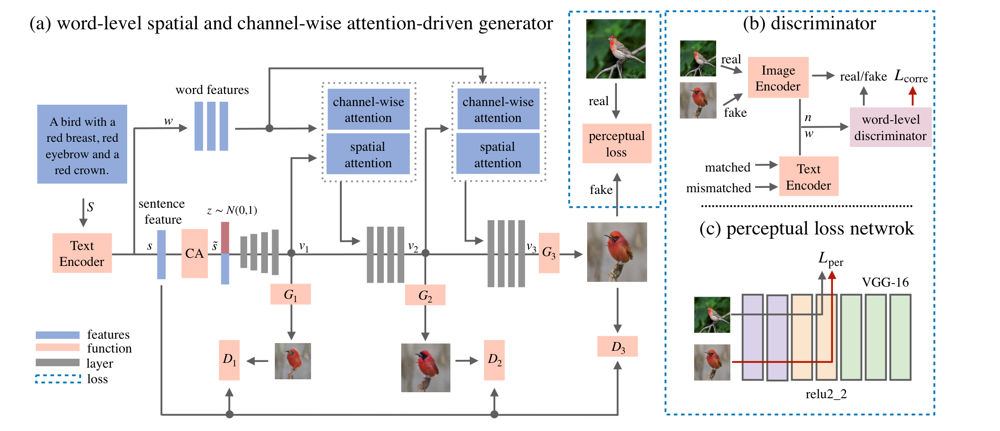

## Controllable Text-to-Image Generation

### 1.What is this paper about?

It proposes a novel controllable text-to-image generative adversarial network which can effectively synthesise high-quality images and also control parts of the image generation according to natural language descriptions.

### 2.What’s better than previous paper?

Previouse one is that the synthetic image would be significantly different from the one generated from the original text when users change some words of a sentence.

It mention about AttenGAN.
> the AttnGAN model that designed a word-level spatial attention to guide the generator to focus on sub-regions corresponding to the most relevant word. However, spatial attention only correlates words with partial regions without taking channel information > > into account. Also, different channels of features in CNNs may have different purposes, and it is crucial to avoid treating all channels without distinction, such that the most relevant channels in the visual features can be fully exploited.

It allows parts of the image to be manipulated in correspondence to the modified text description while preserving other unrelated content.

### 3.What are important parts of technique and methods?

 

- The word-level spatial and channel-wise attention-driven generator

It allow the generator to synthesise subregions corresponding to the most relevant words. For example, it can obtain semantic correlations with the corresponding images and correlations with color descriptions.

- The word-level discriminator

It can disentangle different visual attributes from the correlation between words and image sub-regions.

- The perceptual loss

It can not only reduce the randomness to synthesis image but also enforce the generator to preserve visual appearance related to the unmodified text.

### 4.How did they verify it?

It evaluated the model in two ways.

- Quantitative results
On the CUB bird and MS COCO datasets, it shows the validity of comparing two state-of-the-art GAN methods(StackGAN++ and AttnGAN) in text-to-image generation using Inception Score and R-precision as metrics.

- Qualitative results
It modified the description of the original image to see how changing it would change the image. The effectiveness of the image manipulation was verified by examining how much the specified words changed and how much the rest of the image remained unchanged.

It shows that it demonstrated by the state-of-the-art output obtained in both tests.

### 5.Is there a debate?

### 6.What paper should I read next?
