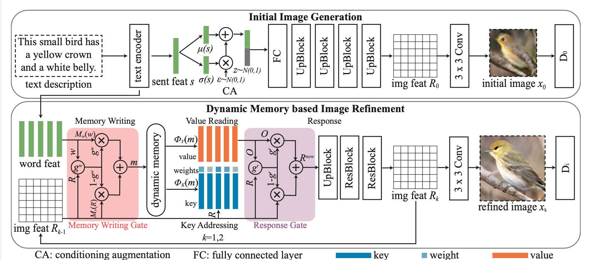

## DM-GAN: Dynamic Memory Generative Adversarial Networks for Text-to-Image Synthesis

### 1.What is this paper about?

It proposes the Dynamic Memory Generative Adversarial Network (DM-GAN) to generate high-quality images by modifying the initial images.

### 2.What’s better than previous paper?

Previous model have two problems.
(1)These methods depend heavily on the quality of the initial images.
(2)Each word in an input sentence has a different level of informa- tion depicting the image content.

It addresses these issues.

### 3.What are important parts of technique and methods?

The architecture of it is composed of two stages: initial image generation and dynamic memory based image refinement.

 

- Gated Memory Writing

It allows the model to select the relevant word to refine the initial images.

- Gated Response

It allows to adaptively fuse information from image and memory.

- (Key Addressing, Value Reading)
They operations are employed to read features from the memory module to refine the visual features of the low-quality images.

### 4.How did they verify it?

- Text-to-Image Quality
It's evaluated on the CUB and the COCO datasets. As a metrics, it use Inception Score (IS), Frechet Inception Distance (FID), and R-precision.

It shows that the experimental results indicate that it is superior to the state-of-the-art models.

- Visual Quality

The validity of this model was demonstrated in three aspects: the ability to recognize foreground and background images, the ability to correct, and diversity.