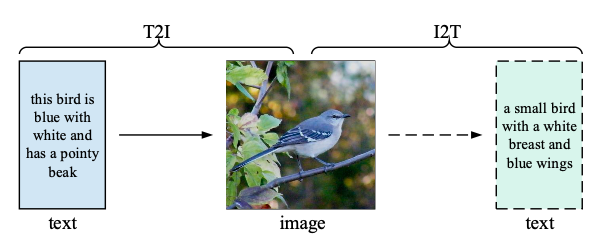
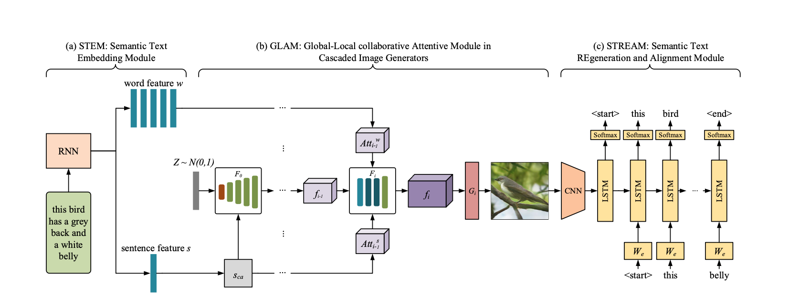

## MirrorGAN: Learning Text-to-image Generation by Redescription

### 1.What is this paper about?

It proposes a novel global-local attentive and semantic-preserving text-to-image-to-text framework called MirrorGAN.

### 2.What’s better than previous paper?

 

By using Text-Image-Text model, it performs not only generate high-quality and visually realistic images but also guaranteeing semantic consistency between the text description and visual content

### 3.What are important parts of technique and methods?

 

It consist of three modules.
- STEM(semantic text embedding module)

It enerates word- and sentence-level embeddings.

- GLAM(global-local collaborative attentive module for cascaded image generation)

It is cascate architecture for generating target images from coarse to fine scales, leveraging both local word attention and global sentence attention to progressively enhance the diversity and semantic consistency of the generated images.

- STREAM(semantic text regener- ation and alignment module)

It egenerates the text description from the generated image, which semantically aligns with the given text description.

### 4.How did they verify it?

- Quantitative result

It valied to compare with state-of-the-art models(GAN-INT-CLS, GAWWN, StackGAN, StackGAN++, PPGN and AttnGAN) using Inception Score and R-precision score on both CUB and COCO datasets.

- Qualitative results

It compare with one of state-of-the-art model(AttenGAN).
It evaluate two type(Subjective visual comparisons and Human evaluation).

The results were better than state-of-the-art in all evaluations.

